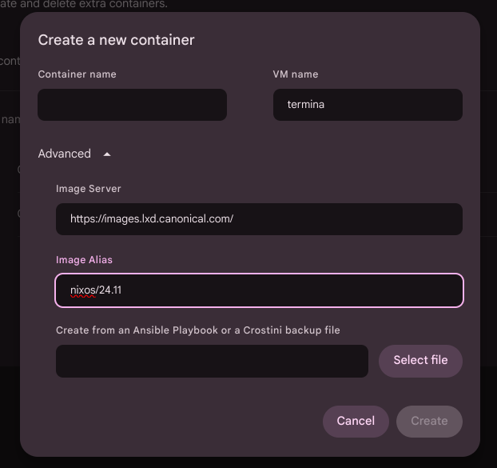

# How to create a NixOS container in Crostini (ChromeOS)

##### March 31, 2025

Linux on ChromeOS, also known as Crostini, allows you to run Linux applications for development alongside your regular ChromeOS desktop and apps.

Google has designed a sophisticated system[^1] of nested environments to run Linux applications in isolation from the host OS while maintaining a "seamless" integration between operating systems.

When you activate the "Linux development environment" on ChromeOS, the system creates a VM running lxd with a single Debian container called "Penguin".

Let's review the main services and terminology we'll use in this guide:

- **Crostini** is the umbrella term for making Linux application support easy to use and integrating well with ChromeOS. It largely focuses on getting you a Terminal with a container with easy access to install whatever developer-focused tools you might want. It's the default first-party experience.

- The **Terminal app** is the first entry point to that environment. It takes care of kicking off everything else in the system that you'll interact with.

- **Termina** is a VM image with a stripped-down ChromeOS linux kernel and userland tools. Its only goal is to boot up as quickly as possible and start running containers. Many of the programs/tools are custom here. In hindsight, we might not have named it one letter off from "Terminal", but so it goes.

- **crosh** (ChromeOS shell): A restricted developer shell for running a handful of commands.

- **Garcon** runs inside the container and provides integration with Cicerone/Chrome for more convenient/natural behavior. For example, if the container wants to open a URL, Garcon takes care of plumbing that request back out.

- **Sommelier** is a Wayland proxy compositor that runs inside the container. Sommelier provides seamless forwarding of contents, input events, clipboard data, etc... between Wayland applications inside the container and Chrome.

All components are open-source, with code available [here](https://chromium.googlesource.com/chromiumos/platform2/+/HEAD/vm_tools)

## Enable custom container support on Crostini

To create a NixOS container, we need to enable custom container support in ChromeOS.
(Note: This step is only necessary if you want the same level of integration as the default container, such as easy access from the Terminal app, one-click URL opening, etc.)

1. Go to *chrome://flags* and enable the *#crostini-multi-container* flag

2. Search for "Linux" in the ChromeOS settings or Settings > About ChromeOS > Linux development enviroment

3. You should now have the "Manage extra containers" options

4. Create a new container with these settings:
 - Image server: [https://images.lxd.canonical.com/](https://images.lxd.canonical.com/)
 - Image alias: `nixos/24.05/amd64` (you can choose from the available versions as *24.05* or *unstable* and archirecute *arm64* or *amd64*)



Now you should see a new container displayed in the terminal. However, clicking on it will likely open a new terminal tab that immediately crashes.

You can find the full guide [here](https://www.reddit.com/r/Crostini/comments/1bwmfyp/how_to_create_custom_containersfinallyyy/).

## Setup the container

We now have the NixOS container created in the VM, but we can't access it like the default one. To fix this, we need to modify the Nix configuration:

1. Open `crosh` with `Ctrl+Alt+t`

2. Enter in the *termina* VM with
```bash
vsh termina
```

3. List all the containers available
```bash
lxc list
```
The output should return a table with two entries, one named *penguin* and the other with the name you have assigned to the container in the previous section

4. Login into the container
```bash
lxc exec test -- sudo --login
```
This command gives you access to the container shell

5. Add this snippet to `/etc/nixos/configuration.nix` [^2]
```nix
systemd.services.garcon = {
    enable      = true;
    description = "Chromium OS Garcon Bridge";
    after       = [ "sommelier@0.service" "sommelier-x@0.service" ];
    script      = "/opt/google/cros-containers/bin/garcon --server --allow_any_user";
    wantedBy    = [ "default.target" ];
};
```

> Garcon is designed to run under user 1000, but we need to launch it as system wide service so we add `--allow_any_user` flag

6. Exit from the container and restart it wit:
```bash
lxc restart nixos
```
7. Return in the Terminal app and try to launch the NixOS container from the homepage

If the container crashes, try rebooting the entire Linux environment (right click on the terminal app in the dock > shut down Linux)

8. (Bonus) If this process doesn't work with your configuration, you can enable SSH in the NixOS container and add the connection to the Terminal app. This way, you can still access the container from the homepage. LXC should always assign the same IP to the container, so you won't need to find the right IP each time.
To find the IP, run `lxc list`

## What's next ?

At this stage, the container cannot launch graphical applications. To enable this functionality, you'll need to integrate the `sommelier` service into your configuration, which requires additional work.
A good starting point for this integration would be examining the [cros-container-guest-tools-git](https://aur.archlinux.org/cgit/aur.git/tree/PKGBUILD?h=cros-container-guest-tools-git) package available on AUR.

If you have any questions or need further assistance, feel free to contact me at  [marioconsalvo1@gmail.com](mailto:marioconsalvo1@gmail.com)

### Refs:

[^1]: [https://www.chromium.org/chromium-os/developer-library/guides/containers/crostini-developer-guide/crostini_services.png](https://www.chromium.org/chromium-os/developer-library/guides/containers/crostini-developer-guide/crostini_services.png)
[^2]: [https://github.com/tazjin/nixini/blob/master/nixini-config.nix](https://github.com/tazjin/nixini/blob/master/nixini-config.nix)
